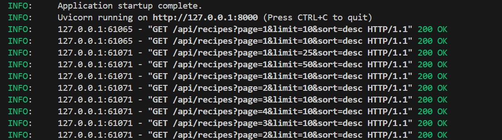
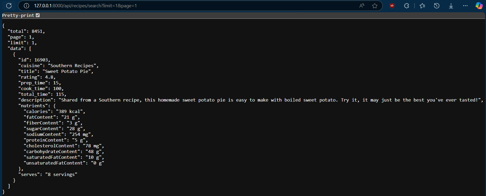
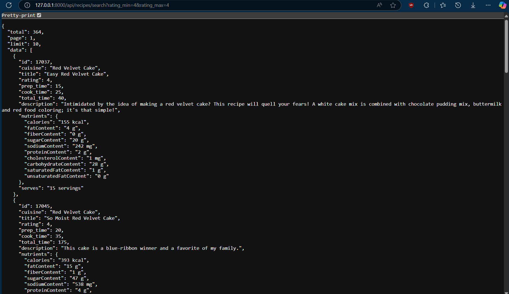
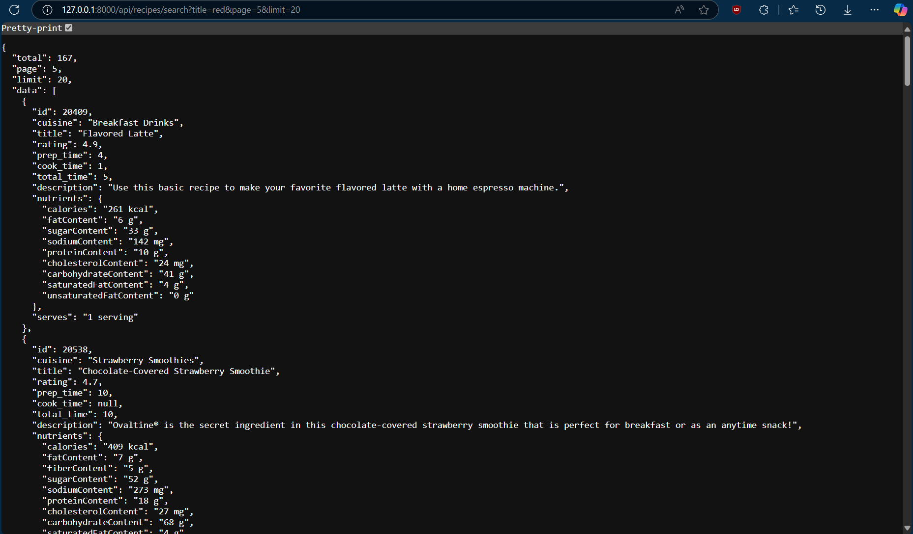
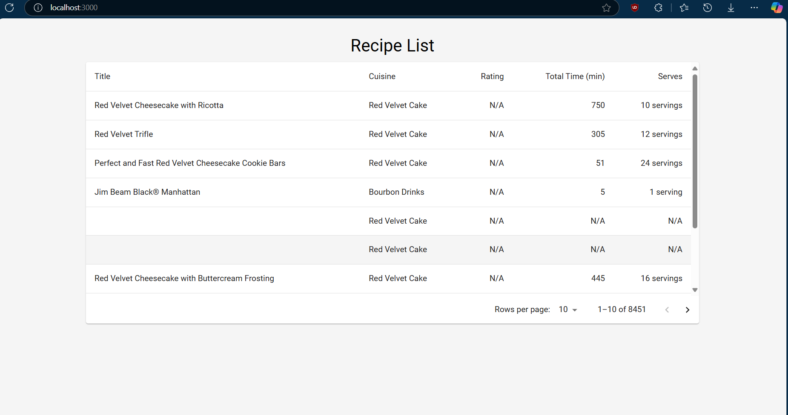
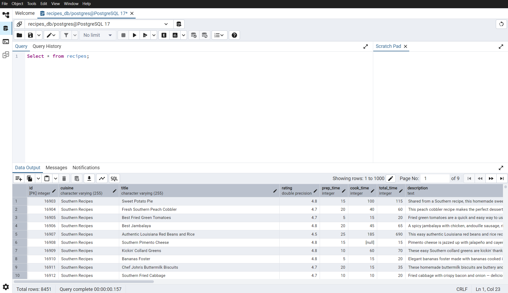
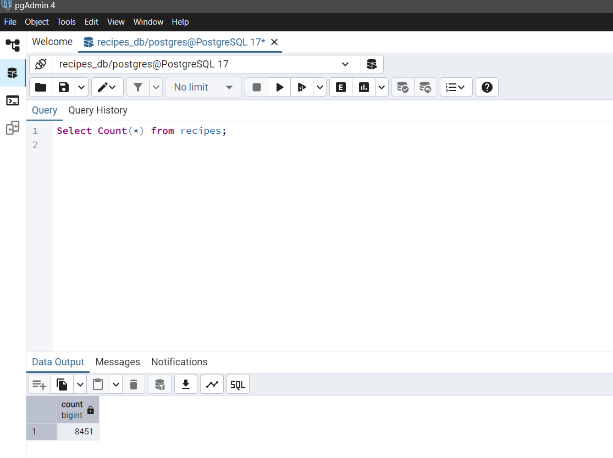

# Recipe Database Application

This project consists of a FastAPI backend and a React frontend for displaying recipe information from a PostgreSQL database.

## Unique Aspects

- Took advantage of PostgreSQL's handling of JSONB format.
- FastAPI's versatile framework helps with easy integration of APIs.
- Simple React frontend to display the database table.


## Challenges Faced

| Challenge | Solution |
|-----------|----------|
| **Adding the correct schema into the postgres database**: Creating the right table structure to store recipe data. | Designed a schema with data types: `SERIAL` for ID, `VARCHAR(255)` for text fields, `FLOAT` for ratings, `INTEGER` for time fields, and `JSONB` for complex nutrient data. Used constraints and indexes. |
| **Requiring to typecast nutrients**: The nutrients data was coming in different formats (string, object, null) making it difficult to store consistently. | Type checking and conversion system that handles different nutrient formats, converts strings to JSON objects, and ensures consistent JSONB storage. |
| **Handling offset**: Managing pagination correctly in the API while maintaining data retrieval and performance. | Implemented proper offset calculation in the API: `offset = (page - 1) * limit`, ensuring data slicing and database queries with `LIMIT` and `OFFSET` clauses. |
| **Handling N/A results in frontend**: Dealing with null or undefined values in the frontend display, especially for ratings and servings. | Null-checking in the React component using conditional rendering and the   coalescing operator (`??`), ensuring display of 'N/A' for missing values while formatting numbers. |

## Prerequisites

- Python 3.8 or higher
- Node.js 14 or higher
- PostgreSQL database
- npm (Node Package Manager)

## Running the project

1. Navigate to the Backend directory:
   ```
   cd Test/Backend
   ```

2. Set up your PostgreSQL database and update the `.env` file with your database credentials:
   ```
   DB_NAME=your_database_name
   DB_USER=your_database_user
   DB_PASSWORD=your_database_password
   DB_HOST=localhost
   DB_PORT=5432
   ```

3. Import the recipe data into the database:
   ```
   python jsontodb.py
   ```

4. Start the backend server:
   ```
   uvicorn api:app --reload
   ```
   The server will start at http://localhost:8000

## Frontend Setup

1. Navigate to the Frontend directory:
   ```
   cd Test/Frontend
   ```

2. Install Node.js dependencies:
   ```
   npm install
   ```

3. Start the development server:
   ```
   npm start
   ```
   The application will open in your browser at http://localhost:3000

## API Endpoints

The backend provides the following API endpoints:

1. `GET /api/recipes`
   - Returns a paginated list of recipes
   - Query parameters:
     - `page`: Page number (default: 1)
     - `limit`: Number of items per page (default: 10, max: 50)
     - `sort`: Sort order ("asc" or "desc", default: "desc")

2. `GET /api/recipes/search`
   - Search recipes with various filters
   - Query parameters:
     - `page`: Page number (default: 1)
     - `limit`: Number of items per page (default: 10, max: 50)
     - `calories_min`: Minimum calories
     - `calories_max`: Maximum calories
     - `cuisine`: Filter by cuisine
     - `title`: Search by title
     - `rating_min`: Minimum rating
     - `rating_max`: Maximum rating
     - `total_time_min`: Minimum total time
     - `total_time_max`: Maximum total time

## Screenshots

1. Backend API running





2. Frontend application

3. Recipe table with data



